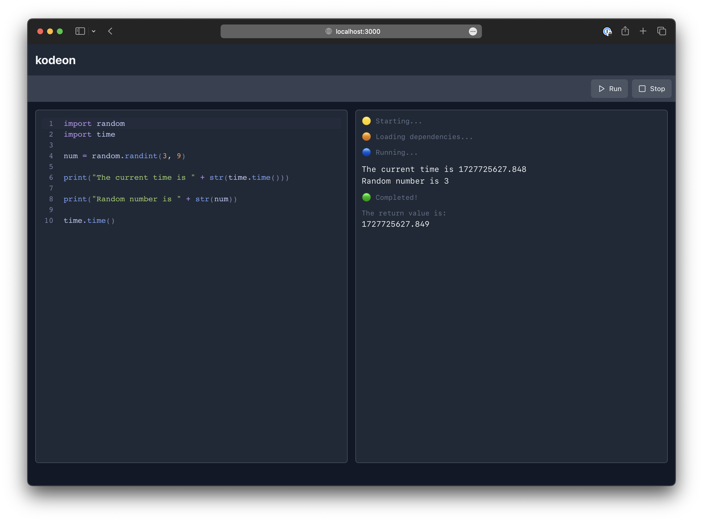
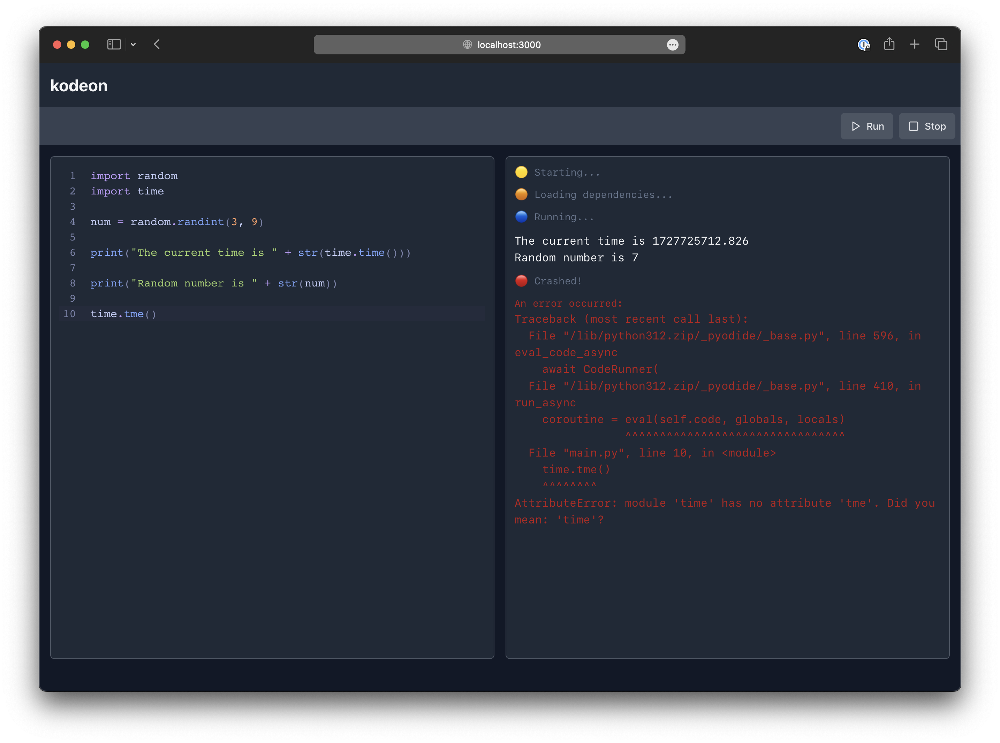

# @kodeon-dev/kodeon-test

Testing an in-browser Python code runtime setup with [Pyodide](https://pyodide.org/en/stable/index.html), [Vite](https://vitejs.dev/guide/), [Typescript](https://www.typescriptlang.org/docs/) & [Web-Workers](https://developer.mozilla.org/en-US/docs/Web/API/Web_Workers_API/Using_web_workers).

## Notes

- Special thanks to [the Pyodide team](https://pyodide.org/en/stable/project/about.html) for their work on Pyodide & the JS API sitting between the two languages.
